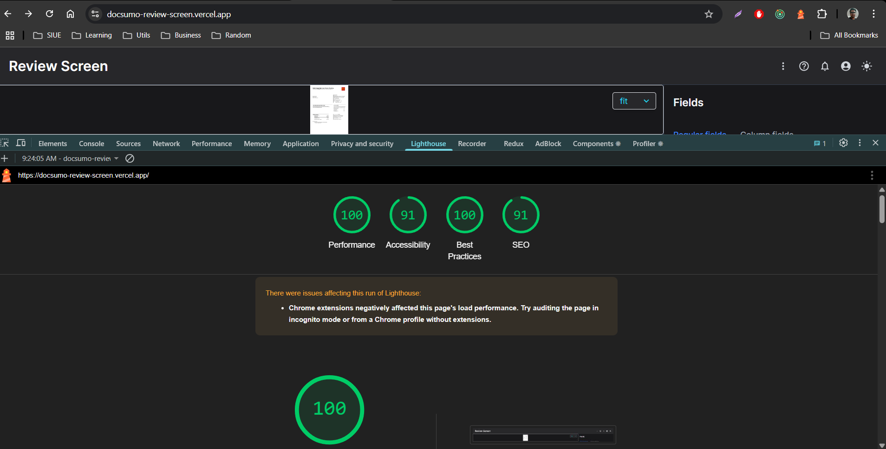

# Docsumo Review Screen

This is an assignment implementation for a review interface using React and Typescript

## Project Structure

- React (with TypeScript) - Component-based UI framework
- TailwindCSS - styling
- Redux Toolkit - state management
- [Vite](https://vite.dev) - Build tool
- React Icons - Icon set
- Vercel - deployment
- HeadlessUI - for building accessible UI components

## Followed pattern - Feature based architecture

## Getting Started

```bash
npm install
npm run dev
```

## Lighthouse performance insight [Production]



## Vercel

https://docsumo-review-screen.vercel.app
